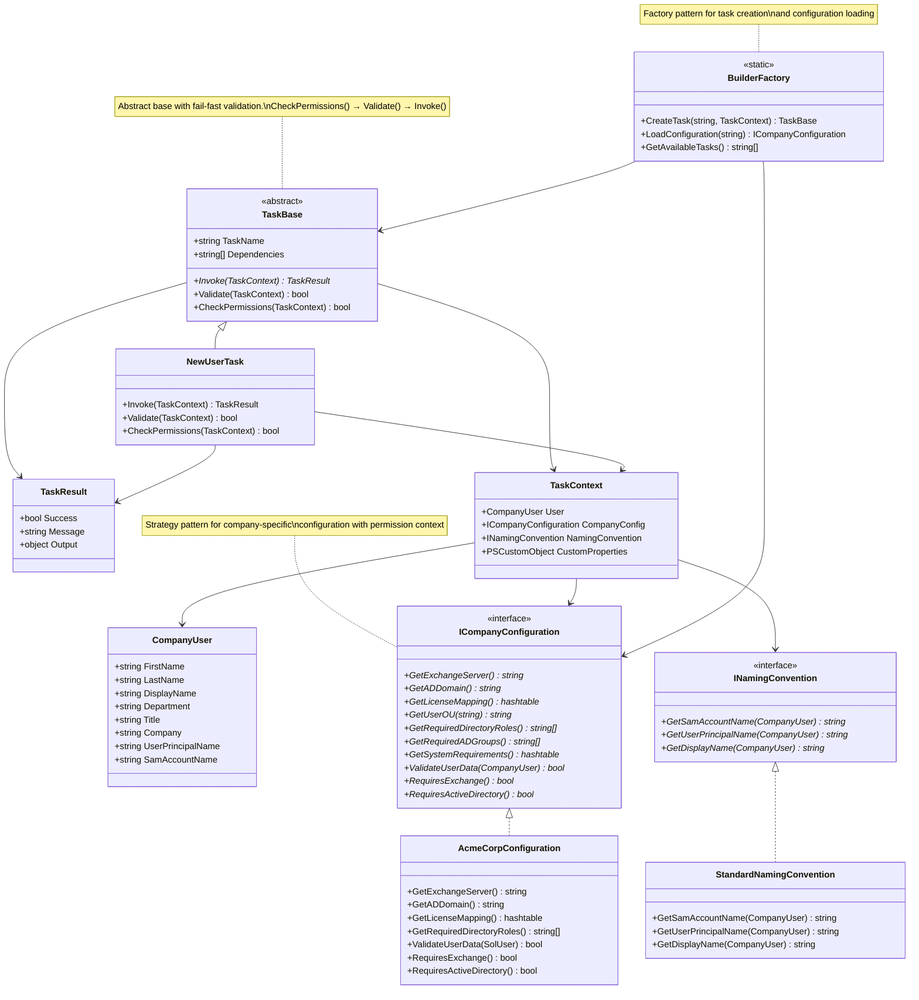
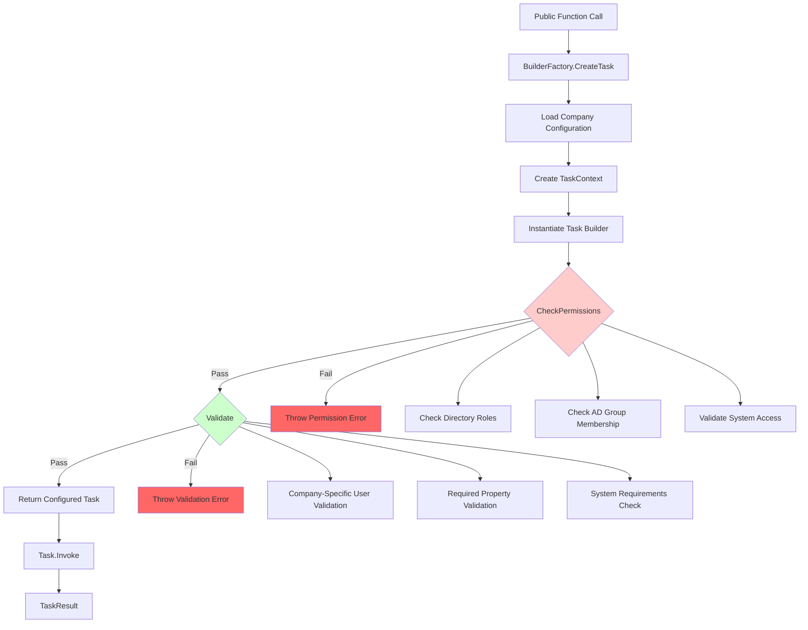

# Component Design

This design is class-based and focuses on a "fail-fast" philosophy with configuration-driven extensibility.

## Architecture Overview



## Configuration-Driven Permission & Validation Flow



### 1. Core Class Definitions

```powershell
# A STRONGLY-TYPED object for the company user being processed.
class CompanyUser {
    [string]$FirstName
    [string]$LastName
    [string]$DisplayName
    [string]$Department
    [string]$Title
    [string]$Company
    [string]$UserPrincipalName
    [string]$SamAccountName
    # etc... other core, known properties will be defined here.
}

# The "Strategy" pattern for generating user names, emails, etc.
class INamingConvention {
    [string]GetSamAccountName([CompanyUser]$User) { throw "Not Implemented" }
    [string]GetUserPrincipalName([CompanyUser]$User) { throw "Not Implemented" }
    [string]GetDisplayName([CompanyUser]$User) { throw "Not Implemented" }
}

# Configuration interface for company-specific settings with permission context
class ICompanyConfiguration {
    # Infrastructure Configuration
    [string] GetExchangeServer() { throw "Not Implemented" }
    [string] GetADDomain() { throw "Not Implemented" }
    [hashtable] GetLicenseMapping() { throw "Not Implemented" }
    [string] GetUserOU([string]$Department) { throw "Not Implemented" }
    
    # Permission Requirements
    [string[]] GetRequiredDirectoryRoles() { throw "Not Implemented" }
    [string[]] GetRequiredADGroups() { throw "Not Implemented" }
    [hashtable] GetSystemRequirements() { throw "Not Implemented" }
    
    # Validation Rules
    [bool] ValidateUserData([CompanyUser]$User) { throw "Not Implemented" }
    [string[]] GetRequiredUserProperties() { throw "Not Implemented" }
    
    # System Requirements
    [bool] RequiresExchange() { throw "Not Implemented" }
    [bool] RequiresActiveDirectory() { throw "Not Implemented" }
}

# The rich context object, now with a truly strongly-typed user object.
class TaskContext {
    # Strongly-typed core properties
    [CompanyUser]$User
    [ICompanyConfiguration]$CompanyConfig    # Enhanced configuration interface
    [INamingConvention]$NamingConvention

    # A property for custom tasks to store their own data
    [PSCustomObject]$CustomProperties = [PSCustomObject]@{}
}

# The standardized output from every task
class TaskResult {
    [bool] $Success
    [string] $Message
    [object] $Output
}

# The abstract base class that defines the "contract" for all tasks
class TaskBase {
    [string]$TaskName = $this.GetType().Name
    [string[]]$Dependencies = @()

    # Method to be overridden by child classes
    [TaskResult] Invoke([TaskContext]$Context) {
        throw "The Invoke() method must be overridden in '$($this.TaskName)'"
    }

    # Enhanced validation method with configuration context
    [bool] Validate([TaskContext]$Context) {
        # Company-specific user data validation
        if (!$Context.CompanyConfig.ValidateUserData($Context.User)) {
            Write-Log -Level Error -Message "User data failed company validation rules"
            return $false
        }
        
        # Check required properties
        $requiredProps = $Context.CompanyConfig.GetRequiredUserProperties()
        foreach ($prop in $requiredProps) {
            if ([string]::IsNullOrEmpty($Context.User.$prop)) {
                Write-Log -Level Error -Message "Required property '$prop' is missing"
                return $false
            }
        }
        
        return $true
    }

    # Enhanced permission check method with configuration context  
    [bool] CheckPermissions([TaskContext]$Context) {
        $config = $Context.CompanyConfig
        
        # Check Microsoft Graph directory roles
        $requiredRoles = $config.GetRequiredDirectoryRoles()
        if (!(Test-MgConnected -DirectoryRoles $requiredRoles)) {
            Write-Log -Level Error -Message "Missing required directory roles: $($requiredRoles -join ', ')"
            return $false
        }
        
        # Check AD permissions if required
        $systemReqs = $config.GetSystemRequirements()
        if ($systemReqs['ActiveDirectory']) {
            $requiredADGroups = $config.GetRequiredADGroups()
            if (!(Assert-ADPermission -AdminGroups $requiredADGroups)) {
                Write-Log -Level Error -Message "Missing required AD groups: $($requiredADGroups -join ', ')"
                return $false
            }
        }
        
        return $true
    }
}

# Factory class for creating tasks and loading configurations
class BuilderFactory {
    static [TaskBase] CreateTask([string]$TaskType, [TaskContext]$Context) {
        $task = switch ($TaskType) {
            'NewUser' { [NewUserTask]::new() }
            # Future task types can be added here
            default { throw "Unknown task type: $TaskType" }
        }
        
        # Fail-fast: Check permissions and validation before returning task
        if (!$task.CheckPermissions($Context)) {
            throw "Permission check failed for task: $TaskType"
        }
        
        if (!$task.Validate($Context)) {
            throw "Validation failed for task: $TaskType"
        }
        
        return $task
    }
    
    static [ICompanyConfiguration] LoadConfiguration([string]$CompanyName) {
        $configPath = "./Configurations/$CompanyName-Config.ps1"
        if (Test-Path $configPath) {
            . $configPath  # Load the company-specific config class
            # Return instance based on loaded configuration
            return switch ($CompanyName) {
                'AcmeCorp' { [AcmeCorpConfiguration]::new() }
                default { throw "No configuration implementation found for: $CompanyName" }
            }
        }
        throw "No configuration found for company: $CompanyName"
    }
    
    static [string[]] GetAvailableTasks() {
        return @('NewUser')  # Will expand as more task types are added
    }
}
```
