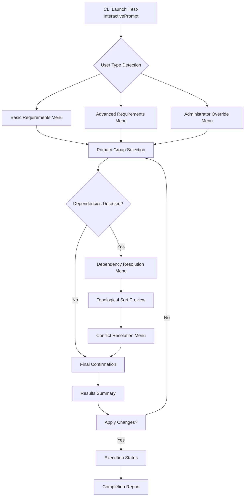
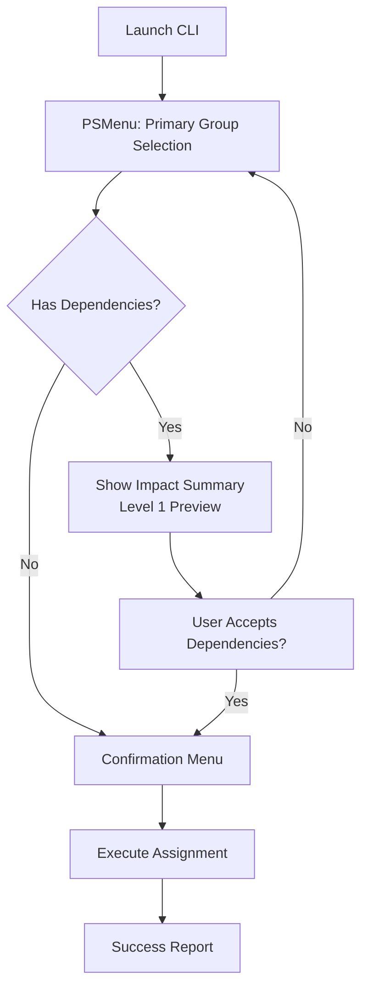
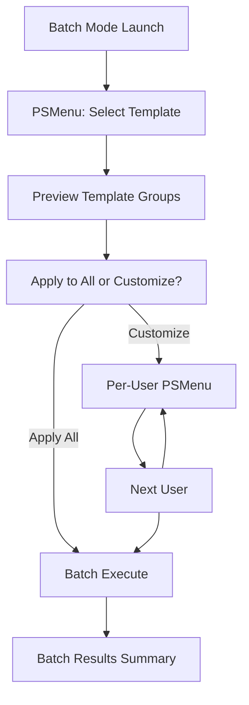

# PSMenu CLI UX Enhancement Specification

## Introduction

This document defines how PSMenu can transform your `Test-InteractivePrompts.ps1` functionality from basic text prompts to rich, interactive menu systems that support your topological prompt sorting logic.

**Current State:** Your CLI uses basic PowerShell prompts and hashtable processing for group membership assignment based on complex requirements and dependencies.

**Enhanced Vision:** PSMenu will provide visual menu navigation, multi-selection capabilities, and improved user feedback while maintaining your existing business logic for topological sorting and conditional group assignments.

## Overall UX Goals & Principles

### Target User Personas

**Primary Persona: IT System Administrator**
- Technical professionals managing user provisioning and group assignments
- Need efficiency and accuracy when processing multiple users
- Comfortable with PowerShell but appreciate clear visual feedback
- Often work in time-pressured environments where mistakes are costly

**Secondary Persona: Help Desk Technician**
- May have less PowerShell experience but need to execute user setup tasks
- Require clear guidance and error prevention
- Benefit from visual confirmation of selections
- Need to understand the implications of their choices

### Usability Goals

1. **Efficiency Enhancement**: Reduce time to complete group assignments from linear text prompts to visual multi-selection
2. **Error Prevention**: Clear visual representation of dependencies and conflicts before submission
3. **Cognitive Load Reduction**: Replace mental mapping of group relationships with visual hierarchy
4. **Confidence Building**: Immediate visual feedback on selections and their implications

### Design Principles

1. **Progressive Disclosure**: Show simple selections first, reveal complex dependencies as needed
2. **Immediate Feedback**: Every selection shows real-time impact on group memberships
3. **Visual Hierarchy**: Use PSMenu's capabilities to show group relationships and dependencies
4. **Fail-Safe Defaults**: Pre-select commonly used options while allowing customization
5. **Contextual Help**: Provide just-in-time information about group purposes and requirements

## Information Architecture (IA)

### CLI Flow Structure



### Navigation Structure

**Primary Navigation Flow:**
- Linear progression through requirement gathering → selection → confirmation → execution
- PSMenu provides visual hierarchy at each decision point
- Breadcrumb-style progress indicators show current step in multi-stage process

**Menu Hierarchy Patterns:**
- **Flat Selection Menus**: For independent group choices (no dependencies)
- **Hierarchical Menus**: For groups with parent-child relationships
- **Multi-Selection Grids**: For bulk operations and complex dependency resolution

**Back/Forward Strategy:**
- PSMenu's built-in navigation allows users to return to previous selections
- State preservation maintains partial selections during navigation
- Clear exit points at every level to prevent user confusion

## User Flows

### Flow 1: Standard Group Assignment

**User Goal:** Assign a user to appropriate groups based on role and requirements

**Entry Points:** 
- Command line: `Test-InteractivePrompt -InteractivePrompts $prompts`
- Script execution with standard parameters

**Success Criteria:** 
- User selects appropriate groups with confidence
- Dependencies are automatically resolved
- Final group list is accurate and complete

#### Flow Diagram


#### Edge Cases & Error Handling:
- **No groups selected**: PSMenu shows "No selections made" warning before exit
- **Conflicting requirements**: Preview shows conflicts, requires user resolution
- **Missing prerequisites**: Preview shows "Will also add: [prerequisite]" messaging
- **User cancellation**: Clean exit at any point without partial application

### Flow 2: Complex Multi-User Batch Processing

**User Goal:** Process multiple users efficiently with similar group patterns

**Entry Points:**
- Batch processing script with user list
- Administrative bulk operations

**Success Criteria:**
- Template selection for common patterns
- Individual customization when needed
- Efficient processing of user list

#### Flow Diagram


## Component Library / Design System

### Design System Approach

**PSMenu-Based CLI Design System**: We'll leverage PSMenu's built-in capabilities and create consistent patterns for your specific use cases, focusing on clarity and efficiency over visual complexity.

### Core Components

#### 1. Primary Selection Menu
**Purpose:** Main group selection interface with visual hierarchy
**Variants:** 
- Single-select (for exclusive choices)
- Multi-select (for group combinations)
- Template-driven (pre-configured patterns)

**States:**
- Default: Available options clearly listed
- Selected: Visual indicators for chosen items
- Disabled: Grayed out items with reasoning ("Requires M365 License")

**Usage Guidelines:** Use for main decision points where users choose primary groups or templates

#### 2. Impact Summary Display
**Purpose:** Level 1 dependency preview showing "what will happen"
**Variants:**
- Simple list format
- Grouped by impact type (Added, Required, Included)

**States:**
- Preview: Shows pending changes
- Confirmed: Shows accepted changes
- Warning: Highlights potential issues

**Usage Guidelines:** Always show before final confirmation, keep to 3-5 lines maximum

**Example Format:**
```
Selected: "Marketing Team Access"
↳ Will also add: "Basic M365 License" (required)
↳ Will also add: "File Server - Marketing Folder" (included)
Total groups: 3
```

#### 3. Credential/Field Prompt
**Purpose:** Minimal prompts for missing template fields
**Variants:**
- Text input (for names, descriptions)
- Secure input (for passwords, sensitive data)
- Selection (for predefined options)

**States:**
- Empty: Clear placeholder text
- Valid: Accepted input with checkmark
- Invalid: Error message with guidance

**Usage Guidelines:** Only prompt for essential missing data, provide sensible defaults when possible

#### 4. Confirmation Menu
**Purpose:** Final review before execution
**Variants:**
- Standard confirmation (Yes/No/Cancel)
- Detailed confirmation (with full impact summary)

**States:**
- Review: All selections summarized
- Processing: Progress indicator during execution
- Complete: Success/failure summary

**Usage Guidelines:** Always include escape option, show complete impact summary

#### 5. Progress Indicator
**Purpose:** Visual feedback during processing
**Variants:**
- Simple progress bar for single operations
- Step indicator for multi-stage processes

**States:**
- In-progress: Clear indication of current activity
- Complete: Success confirmation
- Error: Clear error message with next steps

**Usage Guidelines:** Use for any operation taking >2 seconds

## Branding & Style Guide

### Visual Identity
**Brand Guidelines:** Command Line Interface - Focus on clarity and professionalism over visual branding

### Color Palette

| Color Type | Usage | PSMenu Implementation |
|------------|-------|---------------------|
| Primary | Selected items, active choices | PSMenu default selection highlighting |
| Secondary | Available options, normal text | Standard console text colors |
| Success | Completed actions, confirmations | Green text for success messages |
| Warning | Missing requirements, cautions | Yellow text for dependency notices |
| Error | Conflicts, failed operations | Red text for errors and conflicts |
| Neutral | Borders, separators, inactive items | Console default colors |

### Typography

#### Font Families
- **Primary:** Console default (Consolas, Courier New, monospace)
- **Emphasis:** Bold variants of console fonts
- **Special:** No special fonts - maintain CLI consistency

#### Information Hierarchy

| Element | Implementation | Usage |
|---------|---------------|--------|
| Titles | ALL CAPS or [BRACKETS] | Section headers, menu titles |
| Selections | > arrow or * bullet | Active/selected items |
| Options | Numbered lists (1. 2. 3.) | Available choices |
| Details | Indented with spaces or ├─ | Dependency information |
| Status | [STATUS] prefix | Success, error, processing states |

### Iconography
**Icon Library:** ASCII characters and symbols compatible with all console environments
- `>` Active selection pointer
- `*` Selected/checked items  
- `!` Warning indicators
- `✓` Success confirmations
- `✗` Error indicators
- `├─` Tree structure indicators
- `└─` Final tree branch

**Usage Guidelines:** Keep icons simple, universally readable, and functional rather than decorative

### Spacing & Layout
**Grid System:** Character-based spacing using console constraints
- Standard indentation: 2-4 spaces
- Menu item spacing: Single line separation
- Section breaks: Double line spacing
- Nested information: Progressive indentation (2, 4, 6 spaces)

**Spacing Scale:**
- Tight: Single character spacing
- Normal: 2-4 character spacing  
- Loose: 6-8 character spacing for major sections

## Responsiveness Strategy

### Breakpoints

| Breakpoint | Min Width | Max Width | Target Context |
|------------|-----------|-----------|----------------|
| Narrow Console | 80 chars | 100 chars | Standard terminal windows |
| Standard Console | 100 chars | 120 chars | Full-screen terminal sessions |
| Wide Console | 120 chars | 160 chars | Ultra-wide monitors, split screens |
| Ultra-Wide | 160+ chars | - | Multi-monitor setups |

### Adaptation Patterns

**Layout Changes:**
- **Narrow**: Single column menus, abbreviated labels, minimal spacing
- **Standard**: Full labels, comfortable spacing, standard PSMenu layout
- **Wide**: Expanded descriptions, multi-column layouts where beneficial
- **Ultra-Wide**: Side-by-side information panels, expanded help text

**Content Priority:**
- **Narrow**: Core functionality only, minimal explanatory text
- **Standard**: Full functionality with standard descriptions
- **Wide**: Enhanced explanations, additional context
- **Ultra-Wide**: Full help text, examples, extended guidance

## Animation & Micro-interactions

### Motion Principles
**CLI-Appropriate Motion**: Minimal, functional animations that enhance usability without being distracting. Rely on PSMenu's built-in transition behaviors and PowerShell's natural text rendering patterns.

### Key Animations
- **Menu Navigation**: PSMenu's default selection highlighting (instantaneous)
- **Text Rendering**: PowerShell's natural line-by-line output (system default speed)
- **Status Updates**: Progressive text display for processing states (real-time as operations complete)
- **Error Feedback**: Immediate text display for validation messages (no delays)

## Performance Considerations

### Performance Goals
- **Menu Response**: Instantaneous selection feedback (PSMenu default)
- **Processing Display**: Real-time status updates as operations complete
- **Memory Usage**: Minimal overhead beyond standard PowerShell execution

### Design Strategies
**Efficient Information Display**: Present only essential information at each step to minimize cognitive load and processing time. Leverage your existing topological sorting efficiency without adding UI overhead.

## Next Steps

### Immediate Actions
1. **Install and test PSMenu** in your development environment with PowerShell 5.1+
2. **Create prototype** of primary group selection menu using your existing InteractivePrompts data
3. **Test template integration** with pre-configured group patterns
4. **Validate Level 1 dependency preview** format with actual data from your topological sorting

### Design Handoff Checklist
- [x] User flows documented for standard and batch processing
- [x] Component patterns defined for PSMenu implementation  
- [x] CLI styling guidelines established
- [x] Responsiveness strategy defined for various console sizes
- [x] Performance goals aligned with existing system efficiency
- [x] Next steps clearly defined for prototype development

## Implementation Priority

Start with the standard single-user flow using PSMenu's multi-select capabilities to replace your current prompt collection logic, then expand to template-based batch processing.

## Final Summary

This specification transforms your existing `Test-InteractivePrompts.ps1` from basic text prompts into a rich, menu-driven experience using PSMenu while preserving all your sophisticated topological sorting and conditional logic. The enhanced UX provides:

- **Visual group selection** instead of text-based prompts
- **Level 1 dependency preview** that builds user confidence
- **Template-driven efficiency** for common scenarios
- **Progressive disclosure** that makes complex logic approachable
- **Professional CLI experience** that maintains PowerShell 5.1+ compatibility

The design leverages PSMenu's strengths while working within CLI constraints, focusing on clarity and efficiency over visual complexity.